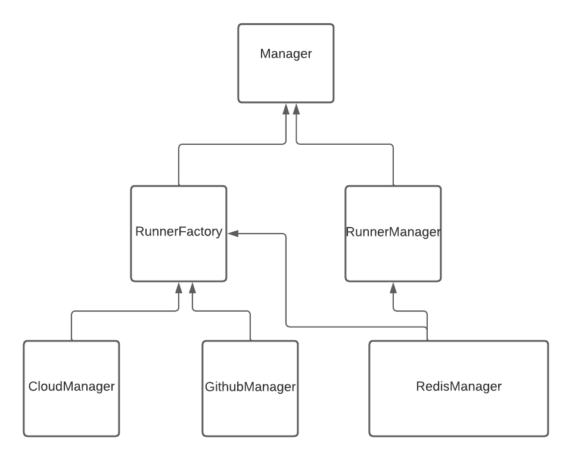

## Runner manager architecture

Each object have his utility,
- [Manager](./srcs/runners_manager/runner/Manager.py) will decide if you decide a new runner.
- [RunnerManager](./srcs/runners_manager/runner/RunnerManager.py) can retreive a runner and update his state depending of the runner state on GitHub.
- [RunnerFactory](./srcs/runners_manager/runner/RunnerFactory.py) use cloudManager and GithubManager to create new runners
- [CloudManager](./srcs/runners_manager/vm_creation/CloudManager.py) is an interface made to manage the creation of each VM. Each new cloud manager create should be in the cloud name folder with a CloudManager object inheritance of it.
- [GithubManager](./srcs/runners_manager/vm_creation/github_actions_api.py) is an object that manage api call to http://api.github.com.
- [RedisManager](./srcs/runners_manager/runner/RedisManager.py) is the object managing the database.
